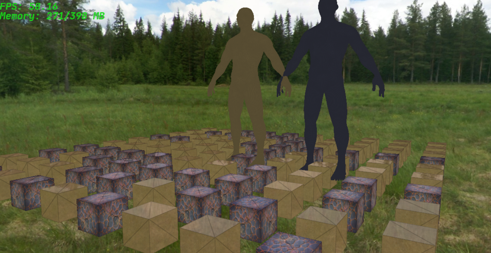

# GameEngine

[](https://codecov.io/github/sefyan0hack/GameEngine) [](https://github.com/sefyan0hack/GameEngine/actions/workflows/CI.yml) 
[](https://opensource.org/licenses/MIT)
[]() 
[]() 
[]() 
[]() 
[]() 
[]() 
[]()

---

## Screenshots

<p align="center">
  
</p>

---

> **GameEngine** — a modern, high-performance foundation for building games and interactive applications with C++23.

## Platforms
- **Windows** (MSVC/GCC/Clang)
- **Linux** (GCC / Clang)
- **Web** (Emscripten)
- **Android** (NDK)

---

## Prerequisites
- C++ compiler with C++23 support (MSVC 2022+, GCC 14+, Clang 19+)
- [CMake](https://cmake.org/) ≥ 3.28
- Optional for targets:
  - Emscripten SDK (for web builds)
  - Android NDK (for Android)
  - OpenGL / Vulkan dev headers for native graphics
- Ninja or Make (recommended: Ninja)

---

## Getting started

Clone the repository and create an out-of-source build directory:

```bash
git clone https://github.com/sefyan0hack/GameEngine.git
cd GameEngine
cmake -S . -B build
cmake --build build --config Release
